## 🎉代码生成(MEE-GENERATOR)🎉
 本工程用于配合[mee-admin](https://github.com/funnyzpc/mee-admin)开发之使用，具体是使用mee-generator生成的代码用于mee-admin开发使用。
  
 欢迎私信 [funnyzpc](https://github.com/funnyzpc) 或 [Issues](https://github.com/funnyzpc/mee-generator/issues/new) 👏 更欢迎的加入😎

## 启动系统
+ 1.🍎导入sql文件,用什么数据库就导入对应的sql脚本
  - [mysql.sql](doc%2Fmysql.sql)
  - [oracle.sql](doc%2Foracle.sql)
  - [postgresql.sql](doc%2Fpostgresql.sql)
+ 2.🍊启动 [MeeGeneratorApplication.java](src%2Fmain%2Fjava%2Fcom%2Fmee%2Fgenerator%2FMeeGeneratorApplication.java)
  - 需添加启动参数
  ```
  - postgresql： --spring.profiles.active=postgresql
  - mysql： --spring.profiles.active=mysql
  - oracle： --spring.profiles.active=oracle
  ```
  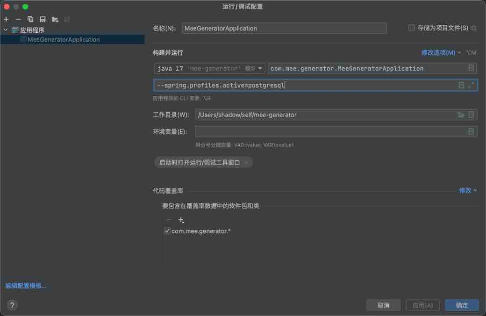  
+ 3.🍐浏览器进入：http://127.0.0.1:8082/mee_generator/

## 使用MEE-GENERATOR
1.添加主配置
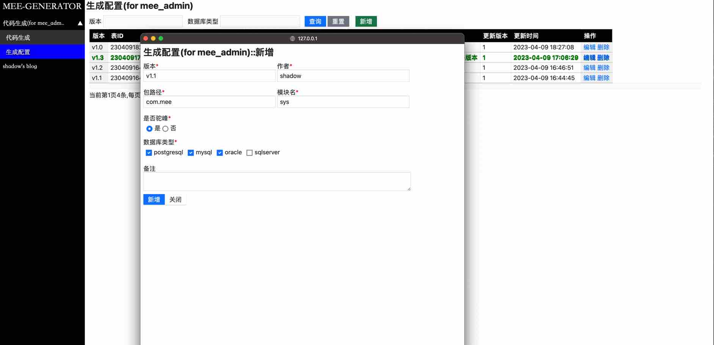
2.开启一个主配置
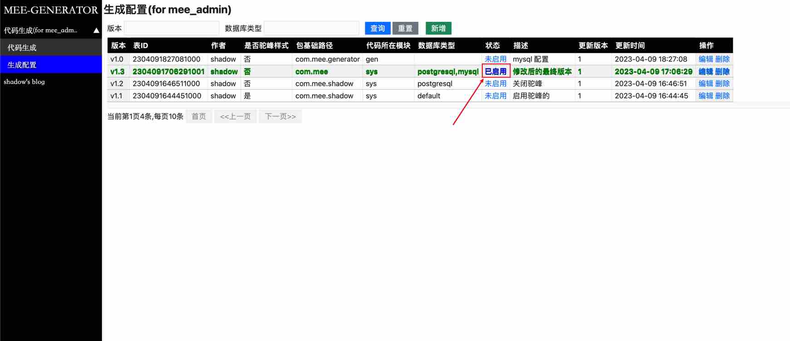
3.导入一个表准备进行配置，导入的表一定要提前新增到mee-generator(schema)中
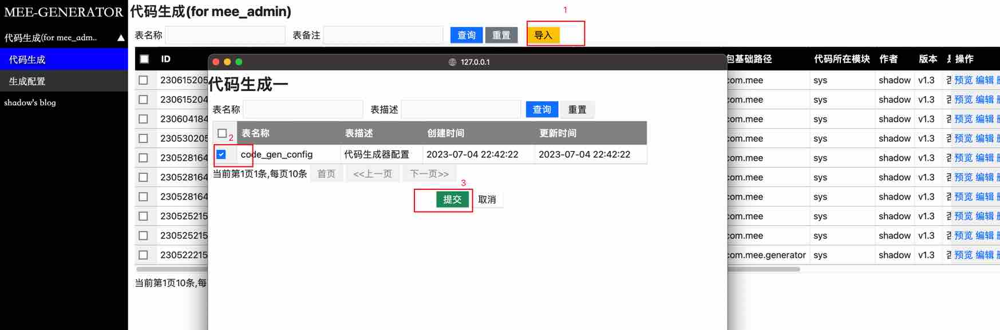
4.选择一个进入配置
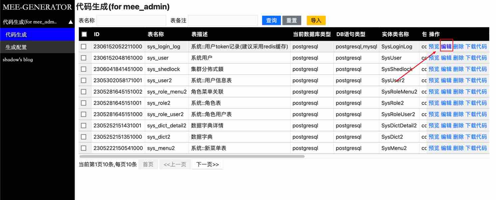
5.配置表基本信息，主意驼峰以及数据库mapper生成类型
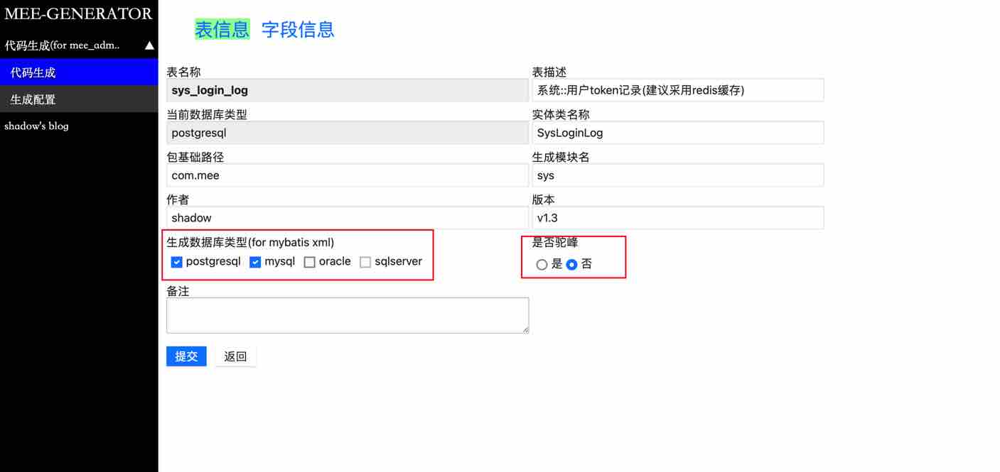
6.配置字段信息，注意如果是驼峰，生成的entity字段就是驼峰样式，其他视情况配置即可
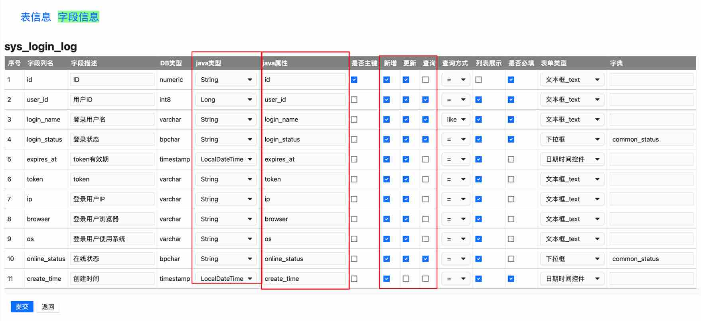
7.所有配置完成记得保存然后点返回
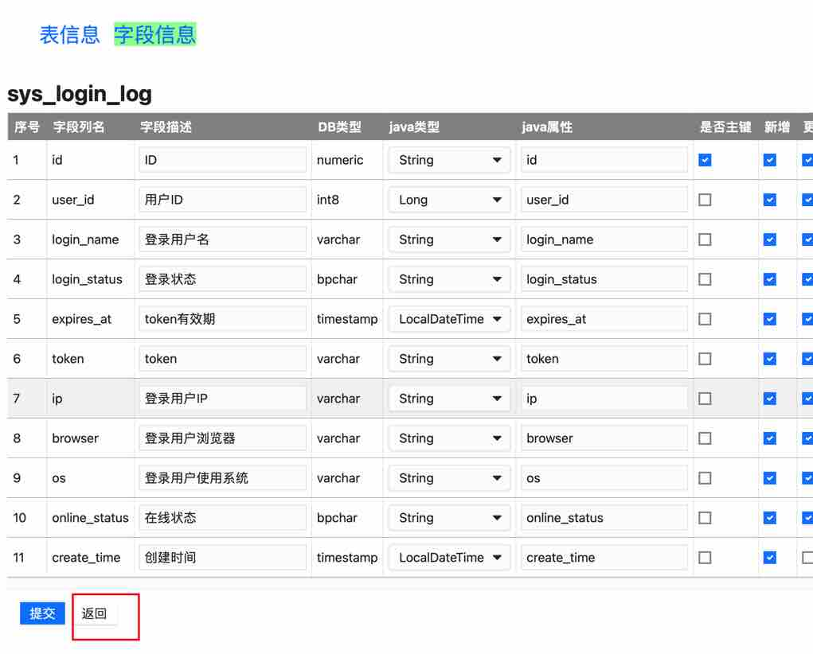
8.列表点预览即可预览所配置的表及字段参数
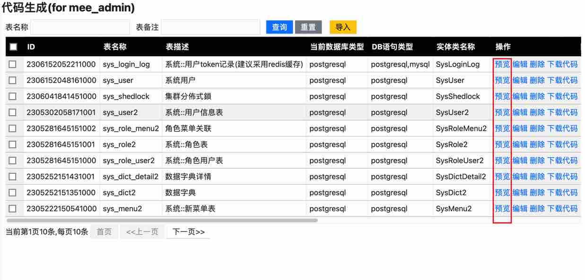
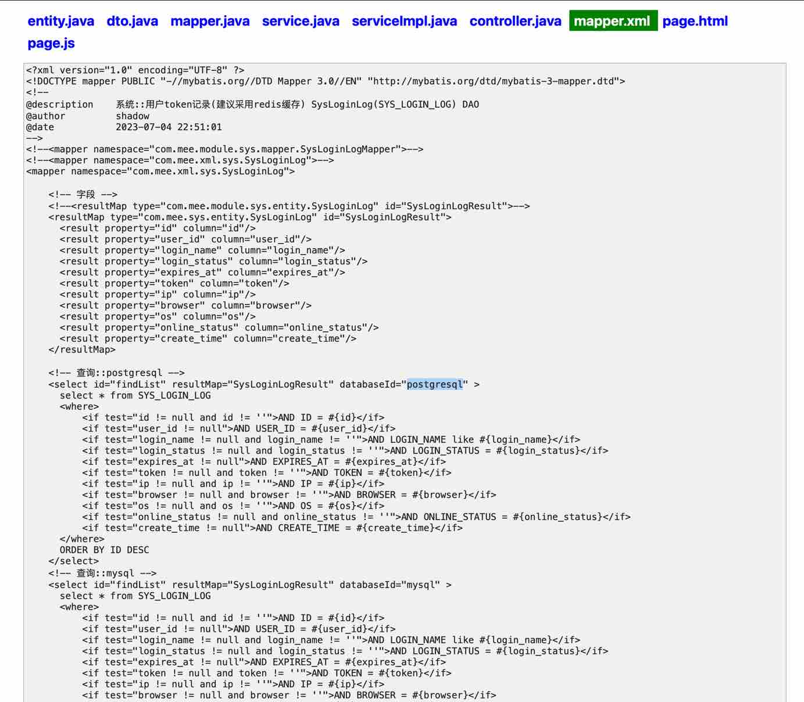
9.配置不合理可重新配置直至完美，记得右侧有下载按钮～
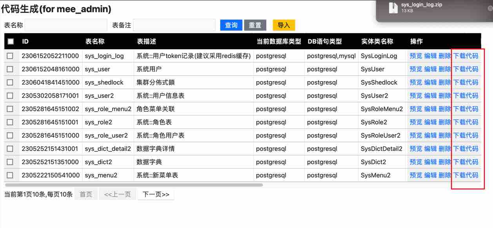